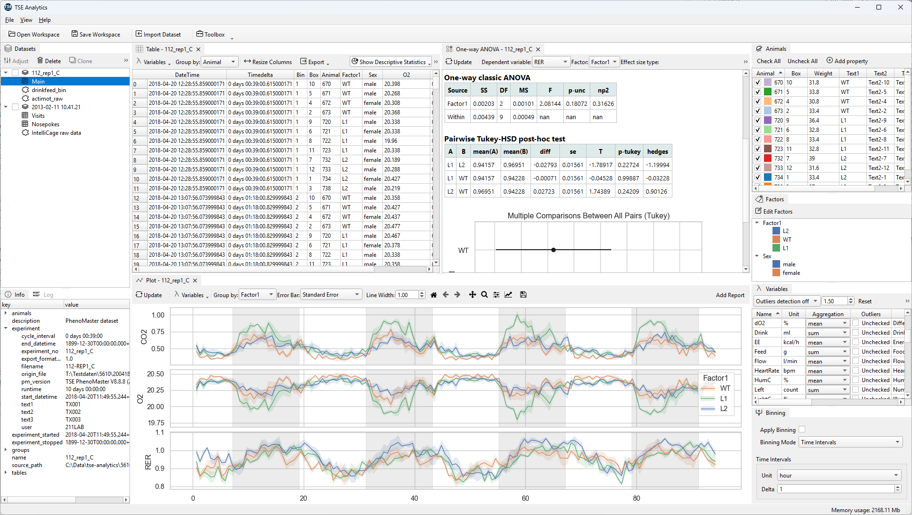

# TSE Analytics

TSE Analytics is a data analysis application designed specifically to work with the data output produced by
[TSE PhenoMaster](https://www.tse-systems.com/service/phenotype/) software. It allows a simplified management of
multiple datasets, data sharing and reproducibility of experimental results in a flexible and user-friendly way.

## Features

### Supported Data Sources
- **PhenoMaster**: Automated metabolic cage monitoring system data
- **IntelliCage**: Automated behavioral testing system for mice with place preference and transitions analysis
- **IntelliMaze**: Maze-based behavioral experiments with support for animal gates, consumption scales, and running wheel tracking

### Data Management
- Working with multiple datasets simultaneously with the option to merge individual datasets and save the whole workspace for later use
- Automatic extraction of meaningful metadata from raw data (animal information, factors, variable sets)
- Applying different data processing parameters on per-dataset level (e.g., different sampling times, etc.)
- Data filtering on per-animal level, including exclusion of animals from data processing
- User-defined flexible time binning with multiple modes:
  - **Time Intervals**: Fixed-duration binning (minutes, hours, days)
  - **Light/Dark Cycles**: Automatic phase-based binning
  - **Time Phases**: Custom phase definitions (e.g., "fasting", "pre-feeding", "sleeping")
- Flexible data grouping: by animals, factors, runs, or total aggregation
- Outliers detection with optional removal of data entries
- Export pre-processed data (CSV, Excel) for external downstream analysis
- Interactive data table with descriptive statistics and sorting

### Data Processing Pipeline
- Node-based visual data processing workflow
- Available pipeline nodes: data input, resampling, transformations, descriptive statistics, normality tests, ANOVA, and report generation
- Modular and extensible architecture for custom analysis workflows

### Visualization Tools
- **Fast Data Plot**: Quick time-series and binned data visualization with scatter overlay and light/dark cycle bands
- **Data Plot**: Advanced multi-variable time-series plotting with configurable error bars (CI, PI, SE, SD)
- **Histogram**: Frequency distribution visualization
- **Distribution**: Violin plots and box plots with optional individual data points overlay
- **Matrix Plot**: Pairwise scatter plot matrix with multiple plot types (scatter, histogram, KDE, regression)
- **Actogram**: Double-plotted circadian rhythm visualization with color-coded activity intensity

### Statistical Analysis
- **Normality Test**: Shapiro-Wilk test with Q-Q plots and distribution overlays
- **One-way ANOVA**: Single-factor comparison with post-hoc tests and effect size calculations
- **N-way ANOVA**: Multi-factor analysis with interaction effects (minimum 2 factors)
- **Repeated Measures ANOVA**: Within-subjects analysis with sphericity testing
- **Mixed-Design ANOVA**: Combined within-subjects and between-subjects analysis
- **ANCOVA**: Analysis of covariance with adjusted group means
- Multiple comparison corrections (Bonferroni, Holm, FDR, etc.)
- Effect size options: Cohen's d, Hedges g, Glass delta, and more

### Correlation & Regression
- **Correlation**: Bivariate analysis with Pearson/Spearman coefficients and significance testing
- **Regression**: Linear regression with confidence intervals and R-squared statistics

### Dimensionality Reduction
- **PCA**: Principal component analysis with scree plots and loadings analysis
- **t-SNE**: Non-linear dimensionality reduction with adjustable perplexity (5-50)
- **MDS**: Multidimensional scaling with stress value reporting

### Time-Series Analysis
- **Periodogram**: Lomb-Scargle frequency analysis for detecting periodic patterns (1-48 hour range)
- **Autocorrelation**: Time-series self-similarity analysis with lag plots
- **Decomposition**: Separate time-series into trend, seasonal, and residual components (Naive or STL methods)

### Reports & Export
- Rich text HTML editor with WYSIWYG formatting
- Embed analysis results and figures directly into reports
- Export reports to HTML for sharing and archiving
- Print support for generating physical documentation
- One-click "Add to Report" functionality from all analysis tools
