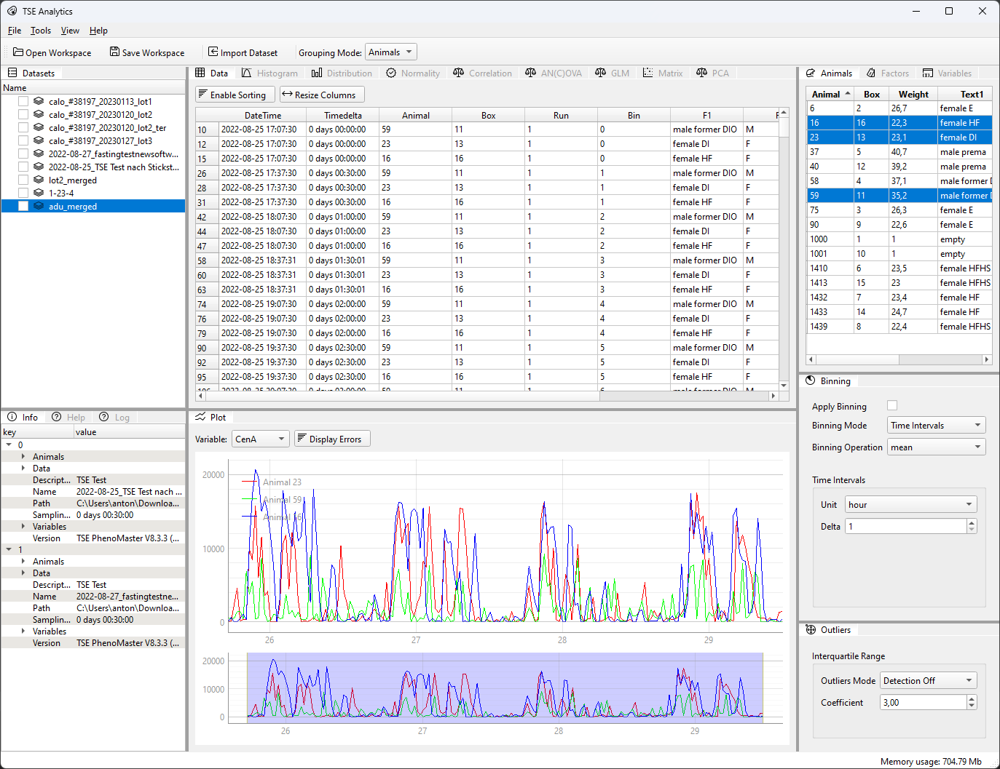
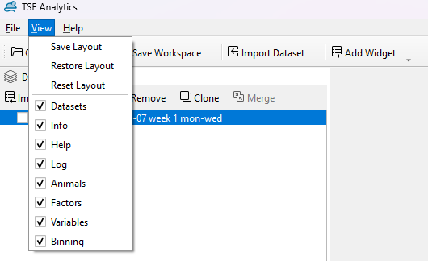
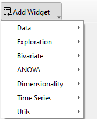

# TSE Analytics

[](https://www.python.org/)
[](LICENSE)
[](CHANGELOG.md)
[](#installation)
[](https://doc.qt.io/qtforpython/)

**TSE Analytics** is a desktop application for analyzing experimental data produced by
[TSE Systems](https://www.tse-systems.com/) hardware — **PhenoMaster**, **IntelliCage**, and
**IntelliMaze**. It provides simplified management of multiple datasets, a rich toolbox of
statistical and visualization analyses, and a node-based processing pipeline — all aimed at making
experimental results reproducible, shareable, and easy to explore.



---

## Table of Contents

- [Key Features](#key-features)
- [Supported Data Sources](#supported-data-sources)
- [Screenshots](#screenshots)
- [Installation](#installation)
- [Getting Started](#getting-started)
- [Features in Detail](#features-in-detail)
- [Tech Stack](#tech-stack)
- [Documentation](#documentation)
- [Contributing](#contributing)
- [Changelog](#changelog)
- [License](#license)
- [About TSE Systems](#about-tse-systems)

---

## Key Features

- Work with **multiple datasets simultaneously**, merge them, and save the whole workspace for later.
- Automatic extraction of metadata (animals, factors, variable sets) from raw data.
- Flexible **time binning** (intervals, light/dark cycles, custom time phases) and **grouping**
  (by animal, factor, experiment, or total).
- **Outlier detection**, per-animal filtering, and CSV/Excel export of pre-processed data.
- A **node-based visual pipeline** for building reusable, reproducible analysis workflows.
- A large analysis **toolbox**: plotting, ANOVA family, correlation/regression, dimensionality
  reduction, chronobiology, time-series, and IntelliCage-specific tools.
- A built-in **AI assistant** (TSE Assistant) for natural-language questions about your data.
- Rich-text **reports** with one-click "Add to Report" from every analysis tool.

---

## Supported Data Sources

| Source | Description |
|--------|-------------|
| **PhenoMaster** | Automated metabolic and behavioral monitoring cages (and extensions such as DrinkFeed, etc.). |
| **IntelliCage** | Automated behavioral testing system for mice, with dedicated transitions, place-preference, and learning-curve analyses. |
| **IntelliMaze** | Maze-based behavioral experiments with support for animal gates, consumption scales, and running-wheel tracking. |

---

## Screenshots

| Datasets & workspace | Adding an analysis |
|----------------------|--------------------|
|  |  |

---

## Installation

### Prerequisites

- **Python 3.14.5** (the exact version pinned in `pyproject.toml`)
- **[uv](https://docs.astral.sh/uv/)** — package & environment manager
- **[Task](https://taskfile.dev/)** — task runner (used for build/test commands)

### Run from source

```bash
# 1. Clone the repository
git clone https://github.com/TSE-Systems/tse-analytics.git
cd tse-analytics

# 2. Create the environment and install dependencies
uv sync

# 3. Launch the application
uv run tse-analytics
```

### Build a distributable

All packaging configuration lives under [`packaging/`](packaging/) — the PyInstaller spec, the
Windows Inno Setup script, and the Linux Flatpak manifest.

**Windows / host-native** — produce a standalone build with PyInstaller (uses
`packaging/tse-analytics.spec`):

```bash
task deploy          # PyInstaller standalone build
task deploy-pyside   # alternative: pyside6-deploy
```

On Windows, the installer is built from `packaging/tse-analytics.iss` (Inno Setup).

**Linux (Flatpak)** — the bundle is built in two steps. The PyInstaller stage runs inside a
manylinux container (requires `podman` or `docker`) so the result is portable across glibc
versions:

```bash
task flatpak-dist    # build the PyInstaller bundle inside a manylinux container
task flatpak         # build & install the Flatpak locally (user)
flatpak run io.github.TSE_Systems.tse_analytics
```

Produce a single-file bundle for distribution:

```bash
task flatpak-bundle  # -> dist/tse-analytics.flatpak
```

> **Note:** the Flatpak is intended for **direct / private distribution** (a `.flatpak` bundle or
> self-hosted repo), not Flathub. Do **not** use `task deploy` for the Flatpak — it links the
> host's glibc and the bundle will fail inside the runtime. See
> [`packaging/flatpak/README.md`](packaging/flatpak/README.md) for full prerequisites (the
> `org.freedesktop.Platform//25.08` runtime/SDK and a container engine) and troubleshooting.

### Install on Linux

End users can install the prebuilt bundle on any machine that has the freedesktop **25.08**
runtime available:

```bash
flatpak install --user dist/tse-analytics.flatpak
```

Pre-built releases (when available) are published on the
[GitHub Releases](https://github.com/TSE-Systems/tse-analytics/releases) page.

---

## Getting Started

A typical workflow looks like this:

1. **Import** raw data from a PhenoMaster, IntelliCage, or IntelliMaze experiment.
2. **Define factors and groups** — assign animals to experimental groups manually or extract them
   automatically from the original animal metadata.
3. **Pre-process** — apply time binning, resampling, per-animal filtering, and outlier handling;
   adjust processing parameters per dataset.
4. **Analyze** — open analysis widgets from the toolbox (`+` menu), or build a reusable workflow in
   the node-based pipeline editor.
5. **Report & export** — collect results into rich-text reports, or export pre-processed data to
   CSV/Excel for downstream analysis.

---

## Features in Detail

### Data Management

- Multiple datasets open at once, with the option to **merge** individual datasets and save the
  entire workspace (DuckDB `.duckdb` files; legacy pickle workspaces are still supported).
- Automatic extraction of meaningful metadata (animal information, factors, variable sets).
- Per-dataset processing parameters (e.g. different sampling/binning times).
- Data filtering on a per-animal level, including exclusion of animals from processing.
- User-defined **time binning** with multiple modes:
  - **Time Intervals** — fixed-duration binning (minutes, hours, days)
  - **Light/Dark Cycles** — automatic phase-based binning
  - **Time Phases** — custom phase definitions (e.g. "fasting", "pre-feeding", "sleeping")
- Flexible **grouping**: by animal, by factor, by experiment, or total aggregation.
- **Outlier detection** with optional removal (IQR, Z-score, min/max thresholds).
- Export pre-processed data (CSV, Excel) for external downstream analysis.
- Interactive data table with descriptive statistics and sorting.

### Data Processing Pipeline

- Node-based visual data-processing workflow (built on NodeGraphQt).
- Available nodes include data input, resampling, transformations, descriptive statistics,
  normality tests, ANOVA, and report generation.
- Modular and extensible — most toolbox analyses ship a matching pipeline node.

### AI Assistant

- **TSE Assistant** — a natural-language data assistant. Ask questions about your dataset in plain
  English, backed by **Anthropic Claude** or a **local LMStudio model**.

### Visualization

- **Fast Line Plot** — high-performance pyqtgraph time-series/scatter plot with a detail + overview
  range slider and per-animal filtering.
- **Line Plot** — multi-variable time-series with mean ± error band (CI, PI, SE, SD), group
  coloring, and light/dark shading.
- **Facet Plot** — Seaborn facet grid of bar plots with error bars (one subplot per facet level).
- **Histogram** — frequency-distribution visualization with group coloring.
- **Distribution** — violin, box, and **raincloud** plots with optional individual-point overlay.
- **Matrix Plot** — pairwise scatter-plot matrix (scatter, histogram, KDE, regression).
- **Actogram** — double-plotted circadian-rhythm visualization with color-coded activity intensity.

### Statistical Analysis

- **Normality Test** — Shapiro–Wilk (and others) with Q–Q plots and distribution overlays.
- **One-way ANOVA** — single-factor comparison with post-hoc tests and effect sizes.
- **N-way ANOVA** — multi-factor analysis with interaction effects.
- **Repeated Measures ANOVA** — within-subjects analysis with sphericity testing.
- **Mixed-Design ANOVA** — combined within- and between-subjects analysis.
- **ANCOVA** — analysis of covariance with adjusted group means.
- **Composite Performance Score** — weighted, normalized (Z-score / min–max) multi-variable score
  with per-direction weighting and a bar plot by group.
- Multiple-comparison corrections (Bonferroni, Holm, FDR, …) and effect-size options
  (Cohen's d, Hedges' g, Glass' delta, …).

### Correlation & Regression

- **Correlation** — bivariate analysis with Pearson/Spearman coefficients and significance testing.
- **Regression** — linear regression with confidence intervals, R², and residual diagnostics.

### Factor Analysis & Dimensionality Reduction

- **Correlation Matrix** — heatmap of pairwise correlations over selected variables.
- **PCA** — principal component analysis with scree plot, biplot, and loadings.
- **t-SNE** — non-linear dimensionality reduction with adjustable perplexity.
- **MDS** — multidimensional scaling with stress-value reporting.
- **UMAP** — manifold projection with configurable neighbors / min-dist / metric.

### Chronobiology & Time Series

- **Chronobiology** — circadian rhythmicity: onset/offset detection, period and harmonic parameters.
- **Periodogram** — Lomb–Scargle frequency analysis for detecting periodic patterns.
- **Autocorrelation** — ACF/PACF analysis of time-series self-similarity.
- **Decomposition** — split a time series into trend, seasonal, and residual components
  (naive or STL).

### IntelliCage Tools

- **Transitions** — corner-transition (Markov) analysis with significance testing and heatmaps.
- **Place Preference** — corner-visit preference filtered by visit condition / nosepoke / lick;
  counts, normalized counts, and durations.
- **Learning Curve** — learning progression (correct visits, place/nosepoke error rate, licks per
  visit), binned by time or visit count, with Excel export.

### Reports & Export

- Rich-text HTML editor with WYSIWYG formatting.
- Embed analysis results and figures directly into reports.
- One-click **"Add to Report"** from every analysis tool.
- Export reports to HTML for sharing/archiving, with print support.

---

## Tech Stack

- **UI:** [PySide6](https://doc.qt.io/qtforpython/) (Qt 6), docking via
  [`pyside6-qtads`](https://pypi.org/project/PySide6-QtAds/), node graph via
  [NodeGraphQt](https://github.com/jchanvfx/NodeGraphQt)
- **Data:** [pandas](https://pandas.pydata.org/) (numpy-nullable dtypes),
  [DuckDB](https://duckdb.org/) persistence
- **Scientific stack:** [scipy](https://scipy.org/),
  [statsmodels](https://www.statsmodels.org/), [scikit-learn](https://scikit-learn.org/),
  [pingouin](https://pingouin-stats.org/), [seaborn](https://seaborn.pydata.org/),
  [matplotlib](https://matplotlib.org/), [pyqtgraph](https://www.pyqtgraph.org/),
  [umap-learn](https://umap-learn.readthedocs.io/), [traja](https://traja.readthedocs.io/)
- **AI:** [Anthropic Claude](https://www.anthropic.com/) and
  [LMStudio](https://lmstudio.ai/) (local models)
- **Tooling:** [uv](https://docs.astral.sh/uv/), [Task](https://taskfile.dev/),
  [Ruff](https://docs.astral.sh/ruff/), [pytest](https://docs.pytest.org/)

---

## Documentation

- **Developer reference** — architecture, subsystem walkthroughs, the full toolbox/pipeline catalog,
  and an extending cookbook: [`dev-docs/`](dev-docs/README.md).
- **End-user documentation** — see the generated site under [`docs/`](docs/).

---

## Contributing

Contributions are welcome! See [CONTRIBUTING.md](CONTRIBUTING.md) for full setup, code-style, and
workflow guidelines. Quick start:

```bash
uv sync          # install dependencies
task test        # run the test suite
task ruff-format # format code
task ruff-check  # lint
```

> **Note:** Generated files (`*_ui.py`, `*_rc.py`) must not be committed. Rebuild them with
> `task build-ui` / `task build-resources` after editing the corresponding `.ui` / `.qrc` sources.

---

## Changelog

See [CHANGELOG.md](CHANGELOG.md) for the release history.

---

## License

TSE Analytics is licensed under the **GNU General Public License v3.0 or later**
(GPL-3.0-or-later). See [LICENSE](LICENSE) for the full text.

---

## About TSE Systems

TSE Analytics is developed by [TSE Systems](https://www.tse-systems.com/) to accompany its
PhenoMaster, IntelliCage, and IntelliMaze platforms. Source code:
[github.com/TSE-Systems/tse-analytics](https://github.com/TSE-Systems/tse-analytics).
