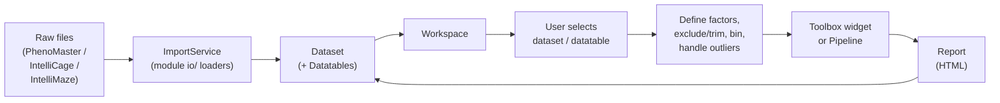

# 01 — Architecture

[← Back to index](README.md)

This document describes the high-level structure of the application: the package layout, how the
app boots, and how data flows from import to analysis. The detailed mechanics of each subsystem are
covered in the dedicated documents linked throughout.

---

## Package layout

Everything ships inside the `tse_analytics/` package.

```
tse_analytics/
├── main.py             # App(QApplication) + entry point
├── globals.py          # global settings, IS_RELEASE flag, library defaults
├── resources_rc.py     # GENERATED from resources/resources.qrc (do not edit)
│
├── core/               # framework: no UI widgets, pure app machinery
│   ├── manager.py      #   service facade (call manager.*)
│   ├── data/           #   domain model (Workspace, Dataset, Datatable, shared types)
│   ├── models/         #   Qt item/table models (TreeItem, PandasModel, …)
│   ├── messaging/      #   pub/sub Messenger + message types
│   ├── services/       #   the four singleton services
│   ├── workers/        #   Worker / WorkerSignals / TaskManager
│   ├── layouts/        #   LayoutManager (wraps pyside6-qtads docking)
│   ├── io/             #   storage.py (DuckDB persistence)
│   └── utils/          #   dtype normalization, formatting, ui helpers, merging
│
├── modules/            # self-contained data-source modules
│   ├── phenomaster/    #   PhenoMaster: io, data, views, extensions/
│   ├── intellicage/    #   IntelliCage: io, data, views, toolbox/
│   └── intellimaze/    #   IntelliMaze: io, data, views, extensions/
│
├── toolbox/            # analysis widgets (histogram, ANOVA, PCA, …) + plugin registry
├── pipeline/           # node-based visual data processing (NodeGraphQt)
├── views/              # shared UI: MainWindow, dialogs, dock widgets, pipeline editor
├── styles/             # SCSS source → compiled QSS themes
└── resources/          # (repo-root) icons/images → compiled to resources_rc.py
```

A useful way to read the layout: **`core/` is the framework, `modules/` are the data sources,
and `toolbox/` + `pipeline/` + `views/` are what the user actually sees and clicks.**

---

## Bootstrap

### `tse_analytics/main.py`

The entry point defines `App(QApplication)` and launches the main window.

`App.__init__` performs the one-time application setup:

- (Windows) sets the AppUserModelID so the taskbar groups the app correctly;
- forces the **Fusion** style and a **light** color scheme;
- sets organization / application metadata (used by `QSettings` — see
  [11-conventions.md](11-conventions.md));
- sets the window icon from Qt resources (`:/icons/...`);
- initializes global settings (`globals.init_global_settings()`);
- loads the QSS stylesheet from `styles/qss/` (default theme `tse-light`);
- constructs the **`TaskManager`** singleton so the worker thread pool exists before any task is
  submitted (see [04-threading-workers.md](04-threading-workers.md)).

The module then creates `MainWindow(sys.argv)` (`views/main_window.py`), shows it, and runs
`app.exec()`. A global `sys.excepthook` routes uncaught exceptions to **loguru** so they reach the
log sink and the Log dock widget. `freeze_support()` is called for PyInstaller-frozen builds.

```python
if __name__ == "__main__":
    freeze_support()
    app = App()
    main_window = MainWindow(sys.argv)
    main_window.show()
    sys.exit(app.exec())
```

The console entry point `tse-analytics = "tse_analytics:main"` (declared in `pyproject.toml`) calls
into this same flow. Run it in development with `uv run tse-analytics`.

### `tse_analytics/globals.py`

Holds process-wide configuration applied at startup:

- `IS_RELEASE` — `getattr(sys, "frozen", False)`; distinguishes a PyInstaller bundle from a dev
  checkout. It changes how on-disk resources (e.g. QSS, pipeline hotkeys) are located (an
  `_internal/` prefix is added when frozen).
- `init_global_settings()` — applies default rendering settings for the scientific libraries
  (e.g. PyQtGraph row-major image axis + background, matplotlib QtAgg backend with figure size
  from settings, seaborn theme) and reads UI defaults (DPI, figure width/height) from `QSettings`.

---

## Runtime flow: import → model → analysis → report



1. **Import.** The user imports a data source. `manager.import_*` delegates to the relevant
   module's `io/` loader (`modules/<module>/io/...`), which builds a `Dataset` with one or more
   `Datatable`s and adds it to the `Workspace`. → [10-modules-extensions.md](10-modules-extensions.md)
2. **Selection.** The user picks a dataset/datatable in the Datasets tree. `SelectionService`
   records the selection and broadcasts `DatasetChangedMessage` / `DatatableChangedMessage`. Every
   widget that reacts to selection is a subscriber. → [02-messaging.md](02-messaging.md)
3. **Prepare.** The user defines **factors** (grouping variables), excludes/renames animals, trims
   or excludes time ranges, resamples (bins), and configures outlier handling. These mutate the
   `Datatable`'s DataFrame and re-broadcast change messages.
   → [05-data-model.md](05-data-model.md)
4. **Analyze.** The user opens a **toolbox widget** (single analysis) or builds a **pipeline**
   (chained nodes). → [08-toolbox.md](08-toolbox.md), [09-pipeline.md](09-pipeline.md)
5. **Report.** Results render as HTML in the widget and can be saved as a `Report` on the dataset
   via `manager.add_report(...)`. Workspaces (including reports) persist to a DuckDB file.
   → [06-persistence.md](06-persistence.md)

---

## The four central patterns (and where they live)

| Pattern | Purpose | Module | Doc |
|---------|---------|--------|-----|
| **Messaging backbone** | Decouple UI ↔ services with typed pub/sub | `core/messaging/` | [02](02-messaging.md) |
| **Service facade** | Single entry point for app state mutations | `core/manager.py`, `core/services/` | [03](03-services-manager.md) |
| **Threading** | Keep the UI responsive during heavy compute | `core/workers/` | [04](04-threading-workers.md) |
| **Domain model** | In-memory representation of experiments | `core/data/` | [05](05-data-model.md) |

These interlock: a UI action calls a `manager.*` function → the service mutates the domain model →
the service **broadcasts** a message → subscribed widgets refresh. Heavy refreshes are pushed onto
a `Worker`. Understanding this loop is the key to working anywhere in the codebase.

---

## Generated vs. authored code

Some files are compiled from source and must **never** be hand-edited or hand-committed as if they
were source (regenerate them via `task`):

- `*_ui.py` — compiled from Qt Designer `.ui` files (`task build-ui`)
- `*_rc.py` — compiled from `.qrc` resource manifests (`task build-resources`)
- `styles/qss/*.css` — compiled from `styles/scss/*.scss` (`task qss`)

See [07-layouts-ui.md](07-layouts-ui.md) and [11-conventions.md](11-conventions.md) for details.

---

**Next:** [02 — Messaging backbone →](02-messaging.md)
