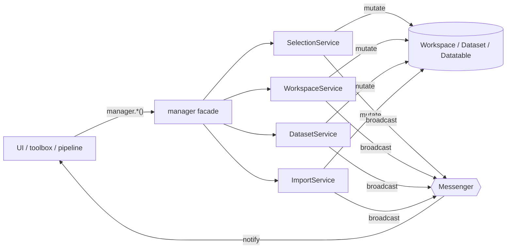

# 03 — Service facade (`manager.py`)

[← Back to index](README.md)

All application **state changes** go through four singleton services. They are wired together in
`core/manager.py`, which re-exports their public methods as plain module-level functions. This is
the **facade** the rest of the app uses.

> **Rule:** call `manager.*` — never instantiate `SelectionService`, `WorkspaceService`,
> `DatasetService`, or `ImportService` yourself. There is exactly one of each, created in
> `manager.py`.

```python
from tse_analytics.core import manager

dataset = manager.get_selected_dataset()
manager.add_report(report)
```

---

## How the facade is wired

`core/manager.py` constructs the services with their dependencies and exposes their bound methods:

```python
selection_service = SelectionService()
workspace_service = WorkspaceService(selection_service)
dataset_service   = DatasetService(workspace_service, selection_service)
importer_service  = ImportService(selection_service, dataset_service, workspace_service)

# …then every public method is re-exported, e.g.:
get_selected_dataset = selection_service.get_selected_dataset
add_dataset          = dataset_service.add_dataset
import_csv_dataset   = importer_service.import_csv_dataset
# …and so on.
```

So `manager.get_selected_dataset` *is* `selection_service.get_selected_dataset`. The facade exists
so callers depend on a stable module surface rather than on the service objects.

Services mutate the [domain model](05-data-model.md) and then **broadcast** the appropriate
[message](02-messaging.md) so the UI can refresh.



---

## The four services

### `SelectionService` — *what is currently selected*
`core/services/selection_service.py`

Tracks the currently selected dataset and datatable; broadcasting on change.

| Function (via `manager.`) | Effect |
|---------------------------|--------|
| `get_selected_dataset()` | Current `Dataset \| None` |
| `set_selected_dataset(dataset)` | Set selection, broadcast `DatasetChangedMessage` |
| `get_selected_datatable()` | Current `Datatable \| None` |
| `set_selected_datatable(datatable)` | Set selection, broadcast `DatatableChangedMessage` |

### `WorkspaceService` — *the open workspace and its persistence*
`core/services/workspace_service.py`

Owns the single in-memory `Workspace` and its load/save lifecycle. Supports the DuckDB `.duckdb`
format and legacy pickle `.workspace` files (chosen by file extension — see
[06-persistence.md](06-persistence.md)).

| Function (via `manager.`) | Effect |
|---------------------------|--------|
| `get_workspace()` | The current `Workspace` |
| `new_workspace()` | Reset to an empty workspace; clears selection; broadcast `WorkspaceChangedMessage` |
| `load_workspace(path)` | Load from `.duckdb` (or legacy `.workspace`) |
| `save_workspace(path)` | Persist to disk |

### `DatasetService` — *CRUD on datasets, datatables, reports*
`core/services/dataset_service.py`

The workhorse for structural changes to the workspace contents.

| Function (via `manager.`) | Effect |
|---------------------------|--------|
| `add_dataset(dataset)` | Add to workspace; broadcast `WorkspaceChangedMessage` |
| `remove_dataset(dataset)` | Remove; clean up selection/widgets |
| `add_datatable(datatable)` | Attach a datatable to its parent dataset |
| `remove_datatable(datatable)` | Detach a datatable |
| `merge_datasets(new_name, datasets, single_run, continuous_mode, generate_new_animal_names)` | Combine multiple datasets (delegates to `core/utils/data_merger.py`) |
| `clone_dataset(original, new_name)` | Deep copy a dataset |
| `clone_datatable(original, new_name)` | Deep copy a datatable |
| `clone_report(original, new_name)` | Deep copy a report |
| `add_report(report)` | Attach a `Report`; broadcast `ReportsChangedMessage` |
| `delete_report(report)` | Remove a report |

`add_report` is what toolbox widgets call when the user clicks **Add Report**
(see [08-toolbox.md](08-toolbox.md)).

### `ImportService` — *bringing data in*
`core/services/import_service.py`

Orchestrates import from the data-source modules and their extensions. Each importer builds/updates
a `Dataset` and broadcasts `WorkspaceChangedMessage`.

| Function (via `manager.`) | Imports |
|---------------------------|---------|
| `import_csv_dataset(...)` | A dataset from CSV (PhenoMaster CSV loader) |
| `import_drinkfeed_data(...)` | DrinkFeed raw/binned data into the selected dataset |
| `import_actimot_data(...)` | ActiMot activity/trajectory raw data |
| `import_calo_data(...)` | Calorimetry data |
| `import_grouphousing_data(...)` | Group-housing data |

The actual file parsing lives in each module's `io/` package; `ImportService` is the coordination
layer. → [10-modules-extensions.md](10-modules-extensions.md)

---

## Practical guidance

- **Reading state** (selection, workspace) is cheap and synchronous — call `manager.get_*` freely.
- **Mutating state** should always go through `manager.*` so the right messages fire. If you mutate
  a model object directly, the UI won't know to refresh.
- **Don't broadcast structural messages yourself** for operations the services already cover — let
  the service do it, so the message contract stays consistent.

---

**Next:** [04 — Threading & workers →](04-threading-workers.md)
