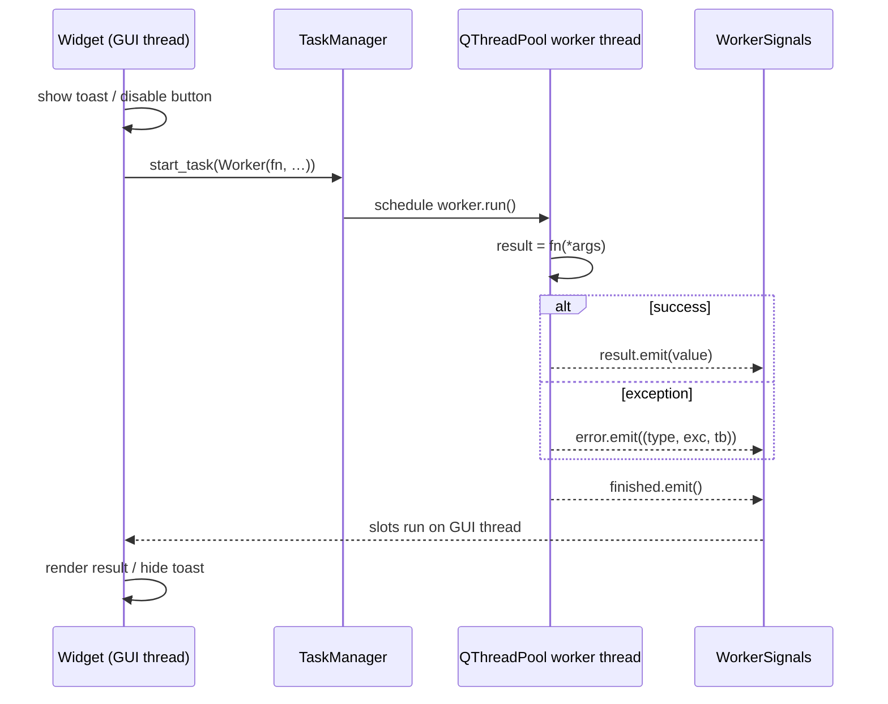

# 04 — Threading & workers

[← Back to index](README.md)

Analyses on real experimental data can take seconds. Running them on the Qt main (GUI) thread
freezes the UI. The rule is simple: **never block the UI thread.** Wrap long work in a `Worker` and
submit it to the shared `TaskManager` thread pool; results return via Qt signals.

**Source:** `core/workers/{worker,worker_signals,task_manager}.py`

---

## The pieces

### `Worker(QRunnable)` — `core/workers/worker.py`

A `QRunnable` that runs an arbitrary callable with captured args on a pool thread.

```python
Worker(fn: Callable[..., Any], *args, **kwargs)
```

Its `run()` (called by the pool):

- calls `fn(*args, **kwargs)`;
- on **success**, emits `signals.result(return_value)` then `signals.finished()`;
- on **exception**, logs it via **loguru** (`logger.opt(exception=e).error(...)`) and emits
  `signals.error((type, exception, traceback_str))` then `signals.finished()`.

`finished` always fires (success or failure), so it is the right place for teardown (hiding a
toast/spinner, re-enabling a button).

### `WorkerSignals(QObject)` — `core/workers/worker_signals.py`

The signal bundle a `Worker` emits on. A separate `QObject` because `QRunnable` is not one.

| Signal | Argument | Meaning |
|--------|----------|---------|
| `finished` | — | Work is done (always emitted) |
| `error` | `tuple` | `(exception_type, exception_value, traceback_string)` |
| `result` | `object` | The return value of `fn` |

### `TaskManager(QObject)` — `core/workers/task_manager.py`

Owns a single shared `QThreadPool` held as **class-level** state. One instance is constructed during
bootstrap in `main.py` (parented to the app so the pool is destroyed with it).

| Member | Purpose |
|--------|---------|
| `TaskManager(parent)` | Construct once at startup; creates the shared `QThreadPool` |
| `TaskManager.start_task(worker, priority=QThread.Priority.IdlePriority)` | Submit a `Worker` to the pool (classmethod). Raises `RuntimeError` if the pool was never initialized |
| `TaskManager.wait_for_done(timeout_ms=-1) -> bool` | Block until all tasks finish (useful in tests / shutdown). `-1` waits forever |

---

## Canonical usage

```python
from tse_analytics.core.workers.worker import Worker
from tse_analytics.core.workers.task_manager import TaskManager


def _heavy_compute(df, settings):
    # CPU-bound work; returns whatever the callback should receive
    return run_pca(df, settings)


worker = Worker(_heavy_compute, self.datatable.get_filtered_df(cols), self._settings)
worker.signals.result.connect(self._on_result)     # runs on the GUI thread
worker.signals.error.connect(self._on_error)
worker.signals.finished.connect(self._on_finished)
TaskManager.start_task(worker)
```



---

## Rules & gotchas

- **Only touch widgets from signal handlers**, not from inside `fn`. `fn` runs off-thread; Qt
  widgets are not thread-safe. Do the compute in `fn`, return plain data, and update the UI in the
  `result` slot (which Qt delivers on the GUI thread).
- **Always handle `error`.** If you don't connect it, failures are still logged by the worker, but
  the user gets no feedback. Toolbox widgets typically show a toast.
- **Don't call `start_task` before bootstrap.** It raises `RuntimeError` if `TaskManager` was never
  constructed. In tests, construct one (with a `QObject` parent) and use `wait_for_done()` for
  deterministic teardown.
- **Pass immutable / copied data into `fn`.** Use `datatable.get_filtered_df(...)` (returns a copy)
  rather than sharing mutable model state across threads.

Toolbox widgets build on this pattern — see how `_update` offloads work and shows a toast in
[08-toolbox.md](08-toolbox.md).

---

**Next:** [05 — Domain model →](05-data-model.md)
