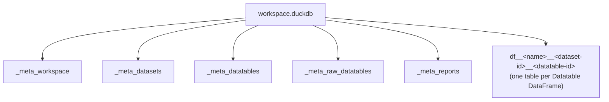

# 06 — Persistence

[← Back to index](README.md)

A workspace is saved to a single **DuckDB** file (`.duckdb`). Legacy **pickle** workspaces
(`.workspace`) remain loadable for backward compatibility. The format is chosen by file extension.

**Source:** `core/io/storage.py` (the DuckDB reader/writer) and
`core/services/workspace_service.py` (the load/save orchestration —
[03-services-manager.md](03-services-manager.md)).

---

## Why DuckDB

A workspace mixes large tabular data (each `Datatable`'s DataFrame) with structured metadata
(animals, factors, variables, outlier settings, reports). DuckDB stores both efficiently in one
file: DataFrames become native columnar tables (preserving dtypes via DuckDB's pandas integration),
and metadata is kept in relational `_meta_*` tables with JSON columns for the pydantic objects.

---

## File structure



### Metadata tables (`_meta_*`)

Defined as DDL in `storage.py` (`_META_TABLES_DDL`). `schema_version` is currently **1**
(`_SCHEMA_VERSION`).

**`_meta_workspace`** — `id UUID`, `name`, `description`, `metadata JSON`, `schema_version UINTEGER`.

**`_meta_datasets`** — `id UUID`, `name`, `description`, `dataset_type VARCHAR`,
`animals JSON` (serialized `dict[str, Animal]`), `factors JSON` (serialized `dict[str, Factor]`),
`metadata JSON`.

**`_meta_datatables`** — `id UUID`, `dataset_id UUID`, `parent_datatable_id UUID` (reserved),
`name`, `description`, `duckdb_table_name VARCHAR` (points at the `df__…` data table),
`variables JSON`, `metadata JSON`, `outliers_settings JSON`.

**`_meta_raw_datatables`** — same shape as `_meta_datatables` but with **`extension_name VARCHAR`**
instead of a parent id; this is how `Dataset.raw_datatables` (extension-namespaced) is reconstructed.

**`_meta_reports`** — `dataset_id UUID`, `report_name VARCHAR`, `content VARCHAR` (HTML),
`timestamp TIMESTAMP`.

### Data tables (`df__…`)

Each `Datatable`'s DataFrame is written to its own DuckDB table whose name is generated by
`_df_table_name`:

```
df__{datatable.name}__{short_id(dataset.id)}__{short_id(datatable.id)}
```

where `short_id` is the last 12 hex chars of the UUID. Empty DataFrames are stored as a
schema-only table (`SELECT * FROM df WHERE 1=0`) so the columns/dtypes survive a round-trip.

---

## Save / load

`storage.py` exposes the round-trip:

- **Save** — creates the file, runs the `_meta_*` DDL, writes each DataFrame to its `df__…` table,
  and inserts the serialized metadata rows. Timing is logged via loguru.
- **Load** — opens the file (read-only), reads the `_meta_*` rows, **validates JSON back into
  pydantic models via `TypeAdapter`** (`Animal`, `Factor`, `Variable`, `OutliersSettings`, …),
  reattaches each DataFrame from its `df__…` table, and rebuilds the `Workspace → Dataset →
  Datatable` graph. On error it logs and returns an empty workspace rather than crashing.

`WorkspaceService.load_workspace` / `save_workspace` dispatch on the path's extension:

| Extension | Format | Notes |
|-----------|--------|-------|
| `.duckdb` | DuckDB (current) | Default; what new saves produce |
| `.workspace` | pickle (legacy) | Read support for older saved workspaces |

---

## Practical notes

- **Anything you put on a `Datatable`/`Dataset` that should persist must be serializable.** Domain
  value types are pydantic dataclasses precisely so they round-trip through the JSON columns. If you
  add a field, make sure it validates back via `TypeAdapter`.
- **Don't rely on `parent_datatable_id`** — it exists in the schema but is currently reserved/unused.
- **Schema changes** should bump `_SCHEMA_VERSION` and handle older versions on load.
- DataFrame **dtypes** are preserved by DuckDB; keep using numpy-nullable types
  (see [05-data-model.md](05-data-model.md)) so saved/loaded frames stay consistent.

---

**Next:** [07 — Layouts & UI →](07-layouts-ui.md)
