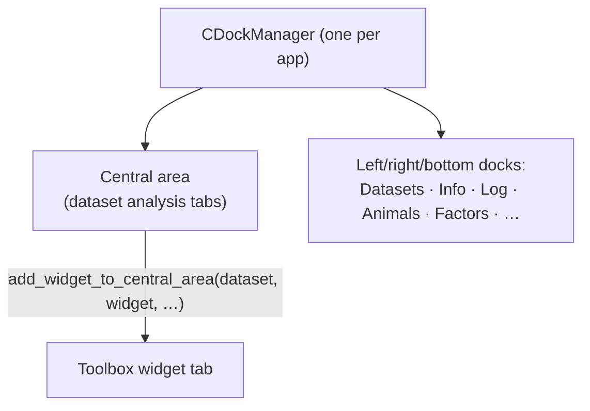

# 07 — Layouts, UI & resources

[← Back to index](README.md)

The UI is a dockable Qt application. This document covers the docking system (`LayoutManager`), the
main window and shared views, and how styles and resources are built.

**Source:** `core/layouts/layout_manager.py`, `views/`, `styles/`, `resources/`.

---

## Docking — `LayoutManager`

`core/layouts/layout_manager.py` wraps **`pyside6-qtads`** (Qt Advanced Docking System,
`CDockManager` / `CDockWidget`) behind a class with class-method helpers. The whole app shares one
dock manager, so `LayoutManager` is used statically.

Representative API (all class methods):

| Method | Purpose |
|--------|---------|
| `register_dock_widget(widget, title, icon, add_to_menu=True) -> CDockWidget` | Wrap a widget as a dock and (optionally) add it to the View menu |
| `set_central_widget()` | Establish the central dock area |
| `add_dock_widget(area, dock_widget)` / `add_dock_widget_to_area(...)` / `add_dock_widget_to_container(...)` | Place a dock in a given area |
| `add_dock_widget_tab(...)` / `add_dock_widget_tab_to_area(...)` | Add as a tab |
| `add_dock_widget_floating(widget)` | Floating window |
| `add_widget_to_central_area(dataset, widget, title, icon) -> CDockWidget` | Open an analysis widget as a central-area tab tied to a dataset |
| `save_state()` / `restore_state(state)` | Serialize / restore the dock layout |
| `add_perspective(name)` / `open_perspective(name)` | Named layout presets |
| `delete_dataset_widgets(dataset)` | Close all central-area widgets belonging to a dataset |
| `clear_dock_manager()` | Reset to the default layout |

`LayoutManager` tracks which central-area widgets belong to which dataset, so closing/removing a
dataset can tear down exactly its widgets (`delete_dataset_widgets`). Layout state is persisted via
`QSettings`.

---

## `MainWindow`

`views/main_window.py` defines `MainWindow(QMainWindow)`. Its UI shell is compiled from
`main_window.ui` into `main_window_ui.py` (generated — see below). On construction it:

- initializes the `LayoutManager` dock manager and registers the default dock widgets — the
  **Datasets** tree, **Info**, **Log**, **Animals**, **Factors**, and related panels;
- wires menu actions/shortcuts (import, save/load workspace, view toggles, toolbox);
- shows live memory usage in the status bar (via `psutil`);
- optionally loads a workspace passed on the command line.

---

## `views/` map

| Path | Contents |
|------|----------|
| `views/main_window.py` | `MainWindow` + the generated `main_window_ui.py` |
| `views/about/` | About dialog |
| `views/animals/` | Animals dock widget (animal list / properties) |
| `views/datasets/` | Datasets tree + `edit_dataset/`, `edit_datatable/`, `merge_datasets/` dialogs |
| `views/factors/` | Factor management widget (define/edit grouping factors) |
| `views/info/` | Info panel for the selected dataset |
| `views/logs/` | Log viewer (loguru sink) |
| `views/settings/` | Settings dialog |
| `views/pipeline/` | The pipeline editor (`PipelineEditorWidget`, hotkeys) — see [09-pipeline.md](09-pipeline.md) |
| `views/pdf/` | PDF/export helpers |
| `views/misc/` | Reusable building blocks (below) |

### Shared building blocks — `views/misc/`

These are the reusable widgets toolbox/pipeline code composes from:

- **Selectors:** `animal_selector.py`, `factor_selector.py`, `variable_selector.py`,
  `group_by_selector.py` — the standard dropdowns toolbox toolbars use.
- **Tables:** `pandas_table_view.py`, `pandas_widget.py`, `animals_table_view.py`,
  `variables_table_widget.py`, `factors_table_widget.py`.
- **Reports:** `report_edit.py` (`ReportEdit`, the HTML view embedded in every toolbox widget) and
  `report_view.py`.
- **Plot infra:** `MplCanvas.py` (matplotlib canvas), `TimedeltaAxisItem.py` (pyqtgraph axis),
  `custom_text_edit.py`, `tooltip_widget.py`.
- **`toolbox_button.py`** — the `ToolboxButton` that reads the [plugin registry](08-toolbox.md) and
  builds the categorized "add analysis" menu.

---

## Styles (SCSS → QSS)

The app is themed with Qt Style Sheets compiled from SCSS.

- **Source:** `styles/scss/` — `_base.scss`, `_defaults.scss`, `default.scss`, `tse-light.scss`,
  `tse-dark.scss`, and a `widgets/` folder of per-widget partials.
- **Compiled:** `styles/qss/` — `default.css`, `tse-light.css`, `tse-dark.css`.
- **Build:** `task qss` (runs `qtsass` over `styles/scss` → `styles/qss`).
- **Loaded:** at startup `App` reads the selected theme (default `tse-light`) from `QSettings` and
  applies the matching `.css`.
- `styles/css.py` additionally provides a `great-tables` theme used to style the HTML tables that
  appear in reports.

> Edit the SCSS, then run `task qss`. Do not hand-edit the compiled `.css`.

---

## Resources (icons → `resources_rc.py`)

- **Source:** `resources/resources.qrc` + `resources/icons/*` (the app icon and the `:/icons/...`
  PNGs referenced throughout, including toolbox icons).
- **Build:** `task build-resources` (runs `pyside6-rcc resources/resources.qrc -o
  tse_analytics/resources_rc.py`).
- **Use:** `QIcon(":/icons/app.ico")`, `QIcon(":/icons/anova.png")`, etc., anywhere in the app.
- `resources_rc.py` is **generated** — never hand-edit it. Add the asset to `resources.qrc` and
  rebuild.

## `.ui` files

Qt Designer `.ui` files (e.g. `main_window.ui`, the ANOVA settings dialogs) compile to `*_ui.py`
via `task build-ui` (`pyside6-uic`). The `*_ui.py` output is **generated** — edit the `.ui`, then
rebuild. See [11-conventions.md](11-conventions.md).

---

**Next:** [08 — Toolbox →](08-toolbox.md)
