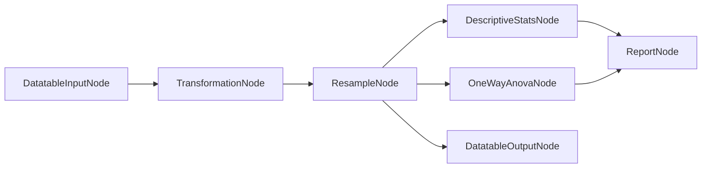

# 09 — Pipeline

[← Back to index](README.md)

The pipeline is a **node-based visual editor** for chaining data-processing and analysis steps. It
is built on [NodeGraphQt](https://github.com/jchanvfx/NodeGraphQt). Where a toolbox widget runs one
analysis, a pipeline lets the user wire several together (input → transform → stats → report).

**Source:** `tse_analytics/pipeline/` (engine) and `views/pipeline/pipeline_editor_widget.py` (UI).

---

## Building blocks

### `PipelinePacket` — `pipeline/pipeline_packet.py`

The immutable unit of data passed between nodes:

```python
@dataclass(frozen=True)
class PipelinePacket:
    value: Any = None                 # the payload (often a DataFrame or result object)
    report: str | None = None         # optional HTML/text to surface in a report
    active: bool = True               # False = this branch should not execute downstream
    meta: Mapping[str, Any] = {}      # routing / diagnostic metadata
```

Helpers: `PipelinePacket.inactive(**meta)` (builds an inactive packet, logging a `reason` if given)
and `with_meta(**updates)` (returns a copy with merged metadata). `active=False` is how the engine
short-circuits branches (e.g. an unsatisfied condition or a missing connection).

### `PipelineNode` — `pipeline/pipeline_node.py`

The base node, extending NodeGraphQt's `BaseNode`:

```python
class PipelineNode(BaseNode):
    NODE_NAME = "PipelineNode"

    def process(self, packet: PipelinePacket) -> PipelinePacket | dict[str, PipelinePacket]:
        return PipelinePacket.inactive(reason="Not implemented")
```

- `process(*input_packets)` consumes upstream packet(s) and returns either a **single**
  `PipelinePacket` (sent to all output ports) or a **`dict[port_name, PipelinePacket]`** to route
  different packets to different output ports (used for branching/conditional nodes).
- A node may also define `initialize(dataset, datatable)`, called before execution so it can read
  the active dataset/datatable and configure itself.

### `PipelineNodeGraph` — `pipeline/pipeline_node_graph.py`

Extends NodeGraphQt's `NodeGraph` and drives execution:

- `initialize_pipeline(dataset, datatable)` — calls `initialize(...)` on every node that defines it.
- `get_execution_order()` — topological sort of the node graph (Kahn's algorithm) over port
  connections.
- `execute_pipeline(dataset) -> dict` — runs nodes in order. For each node it gathers the packets
  from connected upstream output ports; if any required input is missing or `inactive`, the node is
  **skipped** (`active` gating). The node's result is stored per output port so downstream nodes can
  fetch it. Returns the map of `(node_id, port_name) → PipelinePacket`.
- Double-clicking a node shows its `PropertiesBinWidget` (parameter editor).



---

## Node catalog

### Core nodes — `pipeline/nodes/` (exported from `pipeline/nodes/__init__.py`)

| Node | Role |
|------|------|
| `DatatableInputNode` | Entry point — emits the active datatable as a packet |
| `DatatableOutputNode` | Sink — collects a resulting datatable |
| `TransformationNode` | Apply a data transformation |
| `ResampleNode` | Resample / bin the data |
| `DescriptiveStatsNode` | Summary statistics |
| `NormalityTestNode` | Normality testing |
| `CheckboxNode` | Boolean condition (drives branching via `active`) |

### Toolbox nodes — `toolbox/*/*_node.py`

Many toolbox analyses ship a node variant wrapping the same `processor.py`. The editor currently
**registers** these toolbox nodes (in `views/pipeline/pipeline_editor_widget.py`):

`ActogramNode`, `AncovaNode`, `CorrelationNode`, `DataPlotNode`, `DistributionNode`,
`HistogramNode`, `MatrixPlotNode`, `MdsNode`, `MixedAnovaNode`, `NWayAnovaNode`, `OneWayAnovaNode`,
`PcaNode`, `RegressionNode`, `ReportNode`, `RmAnovaNode`, `TsneNode`.

> Note: `correlation_matrix_node.py` and `umap_node.py` exist in the toolbox but are **not**
> currently registered in the editor's `register_nodes([...])` list. To expose them, add the import
> and list entry (see [12-extending.md](12-extending.md)).

---

## The editor — `PipelineEditorWidget`

`views/pipeline/pipeline_editor_widget.py` hosts the graph and its toolbar:

- **Toolbar:** New, Open, Save, Save As, Palette, Tree, **Initialize Pipeline**, **Execute Pipeline**.
- Builds a `PipelineNodeGraph`, registers all node classes via `graph.register_nodes([...])`, and
  embeds NodeGraphQt's `NodesPaletteWidget` and `NodesTreeWidget` for adding nodes.
- Right-click hotkeys/context menu come from `views/pipeline/hotkeys.py` (the menu resource path is
  adjusted for frozen builds via `IS_RELEASE`).
- Emits `pipeline_executed(result)` when a run completes, carrying the `execute_pipeline` output.

Typical interaction: drop a `DatatableInputNode`, wire transforms/analyses, end at `ReportNode` /
`DatatableOutputNode`, click **Initialize** (binds the active dataset/datatable), then **Execute**.

---

**Next:** [10 — Modules & extensions →](10-modules-extensions.md)
