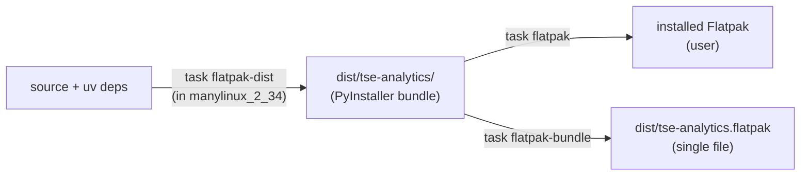

# 13 — Packaging & deployment

[← Back to index](README.md)

This document covers how TSE Analytics is built into a distributable application. There are
two targets — a **Windows installer** and a **Linux Flatpak** — and both wrap the same
**PyInstaller** bundle of the app. It is a developer overview that points at the canonical
sources rather than duplicating them; the detailed Flatpak guide lives in
[`packaging/flatpak/README.md`](../packaging/flatpak/README.md).

**Source:** `packaging/` (specs + Flatpak assets) and the deploy / flatpak tasks in
`Taskfile.yml`.

---

## `packaging/` layout

All packaging configuration lives at the repo root under `packaging/` (renamed from the
old `setup/` directory — update any bookmarks):

```
packaging/
├── tse-analytics.spec   # PyInstaller build spec (the frozen app bundle)
├── tse-analytics.iss    # Inno Setup script (Windows installer)
└── flatpak/             # Linux Flatpak build
    ├── io.github.TSE_Systems.tse_analytics.yml        # flatpak-builder manifest
    ├── io.github.TSE_Systems.tse_analytics.desktop    # desktop entry
    ├── io.github.TSE_Systems.tse_analytics.metainfo.xml  # AppStream metadata
    ├── io.github.TSE_Systems.tse_analytics.png        # 256×256 icon
    ├── tse-analytics.sh                                # launcher (forces xcb)
    ├── build-dist-in-manylinux.sh                      # PyInstaller-in-container build
    └── README.md                                       # full Flatpak guide
```

Both targets start from the same PyInstaller bundle, so a frozen build behaves the same
across platforms — the `IS_RELEASE` flag (`getattr(sys, "frozen", False)`) and
`freeze_support()` that drive frozen-vs-dev resource loading are described in
[01-architecture.md](01-architecture.md).

---

## Windows: PyInstaller + Inno Setup

```sh
task deploy            # uv sync + pyinstaller --clean packaging/tse-analytics.spec  -> dist/
```

`task deploy` syncs dependencies and runs PyInstaller against `packaging/tse-analytics.spec`,
producing the frozen app under `dist/`. The Inno Setup script `packaging/tse-analytics.iss` then turns that `dist/` output
into a Windows installer (its `Output` directory lives under `packaging/`).

`task deploy-pyside` is an alternative one-shot build via `pyside6-deploy`
(`pysidedeploy.spec`) instead of a hand-written PyInstaller spec.

`task deploy` also serves as a **host-native** Linux build — but do **not** use it to feed
the Flatpak (see the next section for why).

---

## Linux: Flatpak (two-stage build)

The Flatpak packages the app for **direct / private distribution** (a single `.flatpak`
bundle or a self-hosted repo). It is **not Flathub-eligible**: Flathub requires building
from source, and the app pins Python `3.14.5` plus a heavy scientific / Rust dependency
stack that no stock Flatpak runtime can reproduce offline. So the Flatpak wraps a
pre-built PyInstaller bundle.

### Why it is two-stage

glibc is backward- but **not forward**-compatible. A PyInstaller bundle built on a
bleeding-edge host (e.g. Fedora's glibc 2.43) pulls in system libraries that demand that
glibc and then fail inside the older-glibc Flatpak runtime with
`version 'GLIBC_2.43' not found`. The freedesktop SDK is too minimal to build against
directly (it lacks libraries PySide6 links, such as the Kerberos `libgssapi_krb5` chain
QtNetwork needs) and is immutable.

The fix: `task flatpak-dist` builds the bundle **inside a `manylinux_2_34` container**
(AlmaLinux 9, glibc 2.34) via `packaging/flatpak/build-dist-in-manylinux.sh`. That is a
full distro where `dnf` provides every native lib Qt needs, while glibc 2.34 stays older
than the runtime — so the result is portable. Requires `podman` (or `docker`).

### Build flow



```sh
task flatpak-dist      # PyInstaller inside the manylinux container -> dist/tse-analytics/
task flatpak           # flatpak-builder --user --install (local install)
task flatpak-bundle    # -> dist/tse-analytics.flatpak (single-file, for distribution)
flatpak run io.github.TSE_Systems.tse_analytics
```

> Do **not** use `task deploy` for the Flatpak — it runs PyInstaller on the host and
> produces a binary that requires the host's glibc.

### Runtime & sandbox

The manifest (`io.github.TSE_Systems.tse_analytics.yml`) pins the
`org.freedesktop.Platform` / `org.freedesktop.Sdk` **`25.08`** runtime and SDK (both must
be installed for `flatpak-builder`, and the runtime must be present on the target machine).
Sandbox `finish-args` grant X11 (`--socket=x11`), IPC, network (for the AI assistant /
LMStudio), GPU (`--device=dri`), and `--filesystem=home`. Qt is forced onto the **xcb**
platform plugin (`--env=QT_QPA_PLATFORM=xcb`, also set in the app code and the launcher
script), which is the reliable path for the bundled Qt inside the sandbox.

> Full prerequisites (Flatpak tooling, runtime install), troubleshooting (e.g. a missing
> `xcb` plugin library), and icon regeneration live in
> [`packaging/flatpak/README.md`](../packaging/flatpak/README.md).

---

## Task reference

| Task | What it does |
|------|--------------|
| `task deploy` | `uv sync` + `pyinstaller --clean packaging/tse-analytics.spec` → `dist/` (Windows or host-native Linux) |
| `task deploy-pyside` | Alternative build via `pyside6-deploy` (`pysidedeploy.spec`) |
| `task flatpak-dist` | Build the PyInstaller bundle inside a `manylinux_2_34` container (portable) |
| `task flatpak` | Build & install the Flatpak locally (user); run `task flatpak-dist` first |
| `task flatpak-bundle` | Build a single-file `dist/tse-analytics.flatpak` for distribution |

---

[← Back to index](README.md)
