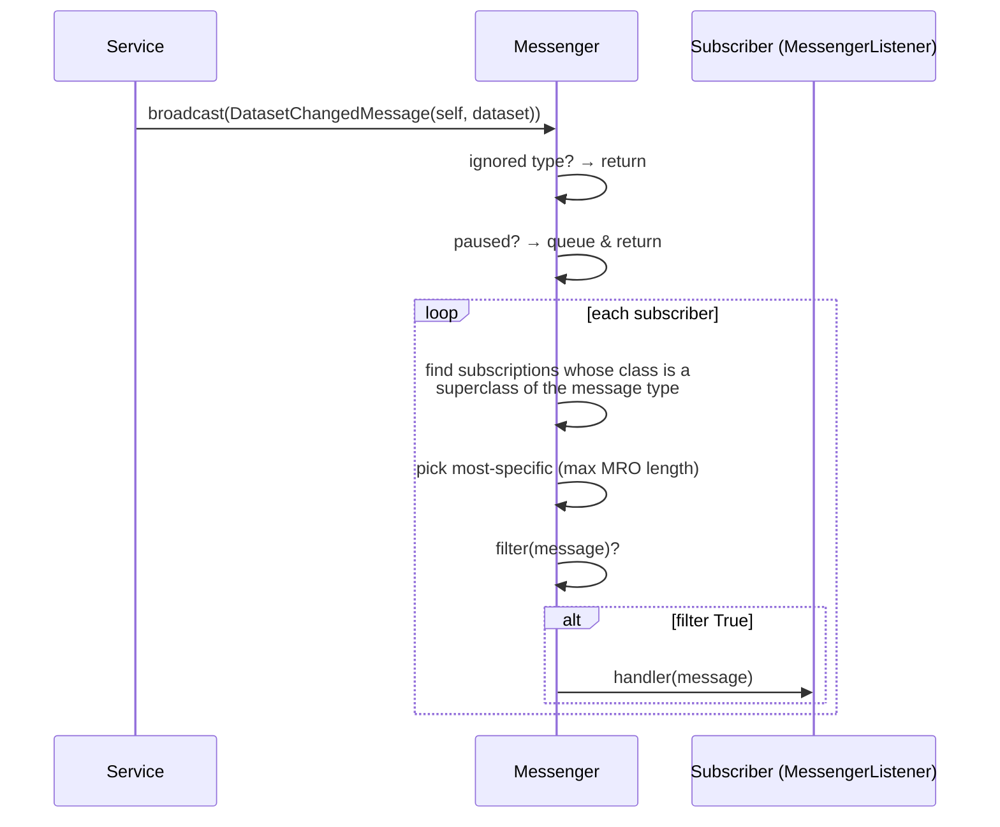

# 02 — Messaging backbone

[← Back to index](README.md)

The messenger is the **central decoupling pattern** in TSE Analytics. Widgets and services never
hold references to each other to coordinate state; instead they broadcast and subscribe to typed
**messages**. Learn this before adding any UI.

**Source:** `core/messaging/{messenger,messages,messenger_listener,messenger_callback_container}.py`
**Public API:** re-exported from `core/messaging/__init__.py` and surfaced as
`from tse_analytics.core import messaging`.

---

## Core ideas

- A **`Message`** is a small typed event object carrying a `sender` plus a payload. Message classes
  form a **hierarchy** rooted at `Message`.
- The **`Messenger`** is a singleton pub/sub broker. Subscribers register interest in a message
  *class*; broadcasting an instance dispatches it to every matching subscriber.
- Subscribing to a class implicitly subscribes you to **all of its subclasses**. When several of a
  subscriber's subscriptions match, the **most specific** (longest MRO) one wins.
- Subscriptions are held in a `WeakKeyDictionary`, so a subscriber that is garbage-collected is
  automatically forgotten — no manual cleanup leak.

---

## The `Message` hierarchy

`Message` (base, in `messages.py`) stores `self.sender`. Every concrete message adds its payload.
The full catalog (all re-exported from `core/messaging/__init__.py`):

| Message | Payload | Broadcast when |
|---------|---------|----------------|
| `SelectedTreeItemChangedMessage` | `tree_item: TreeItem` | The selected item in a tree view changes |
| `DataChangedMessage` | `dataset: Dataset` | The data of a dataset changed (e.g. after edit) |
| `OutliersChangedMessage` | `datatable: Datatable` | A datatable's outlier settings/results changed |
| `WorkspaceChangedMessage` | `workspace: Workspace` | The workspace structure changed (add/remove dataset, import) |
| `DatasetChangedMessage` | `dataset: Dataset \| None` | The selected dataset changed (`None` = cleared) |
| `DatatableChangedMessage` | `datatable: Datatable \| None` | The selected datatable changed (`None` = cleared) |
| `ReportsChangedMessage` | `report: Report \| None` | A report was added/removed/changed |
| `AddToReportMessage` | `dataset: Dataset` | Something should be appended to the dataset's report |

Because the hierarchy is honored, a subscriber to the base `Message` would receive *all* of the
above — useful for logging/diagnostics, rarely what a widget wants.

---

## The `Messenger` API

The singleton is created in `core/messaging/__init__.py` and its bound methods are exported as
module-level functions:

```python
from tse_analytics.core import messaging

messaging.subscribe(subscriber, message_class, handler=None, filter=lambda m: True)
messaging.broadcast(message)
messaging.unsubscribe(subscriber, message_class)
messaging.unsubscribe_all(subscriber)
messaging.is_subscribed(subscriber, message_class)
messaging.get_handler(subscriber, message_class)
```

- **`subscribe(subscriber, message_class, handler=None, filter=…)`**
  - `subscriber` **must** be a `MessengerListener` (else `InvalidSubscriber` is raised).
  - `message_class` **must** be a `Message` subclass (else `InvalidMessage` is raised).
  - `handler` is `handler(message) -> None`. If omitted, the subscriber's `notify` method is used.
  - `filter` is `filter(message) -> bool`; the handler runs only when it returns `True`. The
    default always passes. Use it to react to, say, only your own datatable.
- **`broadcast(message)`** dispatches synchronously to all matching `(subscriber, handler)` pairs.
- **`unsubscribe` / `unsubscribe_all`** remove one / all of a subscriber's subscriptions.

### Dispatch sequence



### Context managers (advanced)

The `Messenger` also exposes two context managers (on the singleton object, not re-exported as
module functions):

- **`ignore_callbacks(message_type)`** — suppress broadcasts of a given type within the block
  (ref-counted, so nesting is safe).
- **`delay_callbacks()`** — queue all broadcasts during the block and flush them on exit. Use this
  to coalesce a burst of changes into a single post-block refresh.

---

## `MessengerListener`

**Source:** `core/messaging/messenger_listener.py`

Any object that subscribes must be a `MessengerListener`. In practice widgets subscribe directly in
`__init__`:

```python
class MyWidget(QWidget, MessengerListener):
    def __init__(self, parent=None):
        super().__init__(parent)
        messaging.subscribe(self, messaging.DatasetChangedMessage, self._on_dataset_changed)
        messaging.subscribe(self, messaging.DatatableChangedMessage, self._on_datatable_changed)

    def _on_dataset_changed(self, message: messaging.DatasetChangedMessage): ...  # message.dataset

    # notify() is the default handler when subscribe() is called without an explicit handler.
```

- `register_to_messenger(self, messenger)` — base-class hook (raises `NotImplementedError` by
  default). The messenger invokes it as `listener.register_to_messenger(self)`; most widgets skip it
  and call `messaging.subscribe(...)` directly in `__init__` as shown above.
- `notify(message)` — default handler when no explicit `handler` is given to `subscribe`.
- `unregister(messenger)` — calls `messenger.unsubscribe_all(self)`.

The weak-reference container (`messenger_callback_container.py`) keeps weak refs to both the
subscriber and the bound handler, reconstructing the bound method on dispatch and pruning dead
entries — this is why subscribers don't leak even if they forget to unsubscribe.

---

## Worked example

```python
from tse_analytics.core import messaging
from tse_analytics.core.messaging.messenger_listener import MessengerListener


class AnimalCountLabel(QLabel, MessengerListener):
    def __init__(self, parent=None):
        super().__init__(parent)
        messaging.subscribe(self, messaging.DatasetChangedMessage, self._update)

    def _update(self, message: messaging.DatasetChangedMessage):
        dataset = message.dataset
        self.setText(f"{len(dataset.animals)} animals" if dataset else "No dataset")


# Elsewhere — a service mutates state and announces it:
messaging.broadcast(messaging.DatasetChangedMessage(sender=self, dataset=new_dataset))
```

The services do exactly this internally — see [03-services-manager.md](03-services-manager.md) for
which service broadcasts which message.

---

**Next:** [03 — Service facade →](03-services-manager.md)
