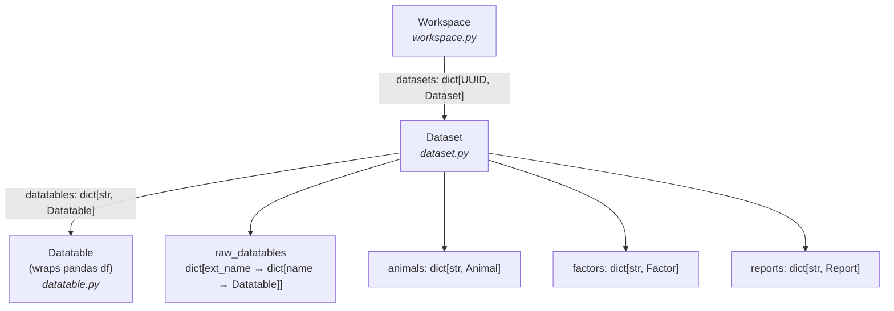

# 05 — Domain model

[← Back to index](README.md)

The domain model is the in-memory representation of experimental data. It lives in `core/data/` and
is deliberately UI-free — services mutate it, widgets read it.

**Source:** `core/data/{workspace,dataset,datatable,report,shared,outliers,factor_appliers,dafault_factor_builders}.py`
plus `core/data/operators/` and the Qt adapters in `core/models/`.

---

## Ownership hierarchy



| Class | File | Role |
|-------|------|------|
| `Workspace` | `workspace.py` | Top-level container; holds all datasets. The unit of persistence. |
| `Dataset` | `dataset.py` | One imported experiment: animals, factors, datatables, reports. |
| `Datatable` | `datatable.py` | A pandas `DataFrame` + column metadata; the thing analyses run on. |
| `Report` | `report.py` | Saved HTML analysis output attached to a dataset. |

Shared value types (`Animal`, `Factor`, `Variable`, …) live in `shared.py`.

---

## `Dataset`

```python
Dataset(name, description, dataset_type, metadata, animals)
```

- `id: UUID` (uuid7), `name`, `description`.
- `dataset_type: DatasetType` — `Literal["PhenoMaster", "IntelliMaze", "IntelliCage"]`.
- `metadata: dict[str, Any]` — experiment info (start/stop times, source path, experiment list, …).
- `animals: dict[str, Animal]`.
- `datatables: dict[str, Datatable]` — the primary, analysis-ready tables.
- `raw_datatables: dict[str, dict[str, Datatable]]` — **extension-namespaced** raw tables, keyed by
  `extension_name` (e.g. `"DrinkFeed"`, `"ActiMot"`, `"Calo"`). → [10-modules-extensions.md](10-modules-extensions.md)
- `factors: dict[str, Factor]` — grouping definitions; always contains the built-in defaults below.
- `reports: dict[str, Report]`.
- `subject_id_column: str = "Animal"` — the subject identifier for repeated-measures stats
  (pingouin's `subject=`); loaders may override.

**Key operations** (each typically rebuilds derived columns and broadcasts a change message):
`set_factors(...)`, `exclude_animals(...)`, `rename_animal(...)`, `exclude_time(...)`,
`trim_time(...)`, `resample(...)` (binning), `clone()` (deep copy), and the `extract_levels_*`
helpers used by the factor-definition UI.

### Built-in default factors

`dafault_factor_builders.py` (the in-repo spelling is intentional — don't "fix" it) defines
`DEFAULT_FACTOR_BUILDERS`, which seeds every dataset with three factors:

| Factor | Role | Config | Levels |
|--------|------|--------|--------|
| `Animal` | between-subject | `ByAnimalConfig` | one level per animal |
| `Total` | between-subject | `ByAnimalConfig` | single `"All animals"` level |
| `LightCycle` | within-subject | `ByTimeOfDayConfig` (07:00 light / 19:00 dark) | `Light`, `Dark` |

---

## `Datatable`

```python
Datatable(dataset, name, description, variables, df, metadata)
```

A `Datatable` wraps a pandas `DataFrame` (`.df`) and adds the metadata analyses need.

- `df: pd.DataFrame` — uses **numpy-nullable dtypes** (`Int64`, `Float64`, `string`, …), normalized
  in `core/utils/data.py`. Always prefer nullable dtypes when adding columns.
- **Standard columns:** `Animal` (categorical), `DateTime` (timestamp), `Timedelta` (elapsed since
  experiment start). `Experiment` appears when datasets are merged. Factor columns are materialized
  as additional categorical columns.
- `variables: dict[str, Variable]` — per-measurement-column metadata.
- `metadata: dict[str, Any]` — e.g. `sample_interval` (a `pd.Timedelta`); raw tables also carry
  `extension_name`.
- `outliers_settings: OutliersSettings` — see below.

**Notable methods:**

- `get_filtered_df(columns=...)` — returns a **copy** of the data with outliers applied (when the
  mode is `REMOVE`). This is the method analyses should call to obtain their working frame — and the
  safe thing to hand to a [worker](04-threading-workers.md).
- `set_factors(factors, old_factor_names)` — (re)materializes factor columns via the appliers.
- `apply_outliers(settings)` — recompute outliers and broadcast `OutliersChangedMessage`.
- `rename_animal`, `exclude_animals`, `exclude_time`, `trim_time`, `resample`, `clone`.
- `Datatable.from_dataframe(...)` — the classmethod any toolbox widget/extension uses to **generate**
  a new datatable from a result DataFrame. → [14-universal-datatable.md](14-universal-datatable.md).
- `is_timeseries` — whether the table has a `DateTime` axis. Cross-sectional tables (e.g. per-animal
  chronobiology parameters) have none, so the time-based members are guarded: `start_timestamp` /
  `end_timestamp` / `duration` **raise**, and `exclude_time` / `trim_time` / `resample` are **no-ops**.
- `sample_interval` normalizes its stored value back to a `pd.Timedelta` (metadata round-trips
  through JSON and would otherwise come back as a `str`).

---

## Shared value types (`shared.py`)

All are pydantic dataclasses (validated, serializable — important for persistence).

- **`Animal`** — `id: str`, `properties: dict[str, Any]` (genotype, group, weight, …).
- **`Variable`** — `name`, `unit`, `description`, `type` (dtype name), `aggregation: Aggregation`,
  `remove_outliers: bool`.
- **`Aggregation`** (`StrEnum`) — `MEAN`, `MEDIAN`, `SUM`, `MIN`, `MAX`. Used when resampling/binning.
- **`Factor`** — `name`, `config: FactorConfig`, `role: FactorRole`, `levels: dict[str, FactorLevel]`.
- **`FactorRole`** (`StrEnum`) — `BETWEEN_SUBJECT` (constant per subject) vs `WITHIN_SUBJECT`
  (varies within a subject across rows).
- **`FactorLevel`** — `name`, `color` (hex), `animal_ids` (used by `BY_ANIMAL`).
- **`TimePhase`** — `name`, `start_timestamp: timedelta` (used by elapsed-time factors).

### Factor configuration — a discriminated union

`FactorConfig` is a pydantic discriminated union (on the `source` field, a `FactorSource` enum)
describing **how each row's level is computed**:

| Config class | `FactorSource` | Level comes from |
|--------------|----------------|------------------|
| `ByAnimalConfig` | `BY_ANIMAL` | explicit `animal_id → level` mapping in `FactorLevel.animal_ids` |
| `ByAnimalPropertyConfig` | `BY_ANIMAL_PROPERTY` | a key in `Animal.properties` (`property_key`) |
| `ByTimeOfDayConfig` | `BY_TIME_OF_DAY` | row `DateTime` time-of-day (`light_cycle_start`/`dark_cycle_start`) |
| `ByElapsedTimeConfig` | `BY_ELAPSED_TIME` | row `Timedelta` vs ordered `phases` |
| `ByColumnConfig` | `BY_COLUMN` | an existing categorical `column` on the df |
| `ByTimeIntervalConfig` | `BY_TIME_INTERVAL` | sequential integer bins of `Timedelta` at `interval` width |

### Factor application

`factor_appliers.py` holds `FACTOR_APPLIERS`, a dispatch table mapping each config type to a
function `(df, factor, dataset) -> None` that **materializes a categorical column** on the
DataFrame. `Dataset.set_factors` / `Datatable.set_factors` drive it. This dispatch-table design is
the extension point for new factor kinds: add a config dataclass to the union and an applier to the
table.

---

## Outliers (`outliers.py` + `operators/outliers_pipe_operator.py`)

`OutliersSettings` configures detection per datatable:

- `mode: OutliersMode` — `OFF`, `HIGHLIGHT` (mark only), `REMOVE` (drop rows from `get_filtered_df`).
- `type: OutliersType` — `IQR` (with `iqr_multiplier`, default 1.5), `ZSCORE`, or `THRESHOLDS`.
- `min_threshold_enabled` / `min_threshold`, `max_threshold_enabled` / `max_threshold`.

`process_outliers(...)` in `operators/outliers_pipe_operator.py` applies the chosen method.
`HIGHLIGHT` is realized in the UI by `PandasModel` (see below), which colors outlier cells.

---

## Qt adapters (`core/models/`)

These bridge the pure domain model to Qt views — they are not part of the model itself:

- `TreeItem` — generic tree node (weak-ref parent, icon/tooltip/checkbox state); specialized as
  `DatasetTreeItem`, `DatatableTreeItem`, `ReportTreeItem` in the Datasets tree.
- `WorkspaceModel` — the `Workspace → Dataset → {Datatables, Reports}` tree model.
- `PandasModel` — a `QAbstractTableModel` over a DataFrame; highlights outlier cells (IQR/Z-score/
  threshold) for the Table widget's `HIGHLIGHT` mode.
- Delegates (`AggregationComboBoxDelegate`, `ColorDialogDelegate`, …) and the factor/animal/variable
  editor models used by the dialogs in [07-layouts-ui.md](07-layouts-ui.md).

---

**Next:** [06 — Persistence →](06-persistence.md)
