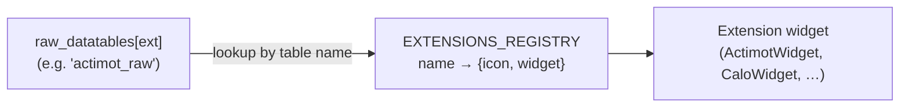

# 10 — Modules & extensions

[← Back to index](README.md)

A **module** encapsulates everything specific to one TSE data source. There are three, matching the
three `DatasetType`s:

| Module | `DatasetType` | Source hardware |
|--------|---------------|-----------------|
| `modules/phenomaster/` | `"PhenoMaster"` | PhenoMaster metabolic/behavior cages |
| `modules/intellicage/` | `"IntelliCage"` | IntelliCage home-cage behavior system |
| `modules/intellimaze/` | `"IntelliMaze"` | IntelliMaze device network |

Modules are self-contained: each owns its import logic, data structures, and views. The core app
treats their output uniformly as `Dataset` / `Datatable` objects ([05-data-model.md](05-data-model.md)).

---

## Module anatomy

Each module follows the same top-level shape:

```
modules/<module>/
├── data/          # module-specific data structures / predefined variables
├── io/            # loaders: import raw files → Dataset / Datatable
├── views/         # module-specific UI (import dialogs, viewers)
└── extensions/    # (phenomaster, intellimaze) pluggable sub-device handlers
```

### `io/` — import

Each module's `io/` package turns raw files into a `Dataset`. Entry points:

- **PhenoMaster** — `io/csv_dataset_loader.py` (CSV) and `io/tse_dataset_loader.py` (native TSE
  format). `io/tse_import_settings.py` defines the raw-table name constants and the
  `TseImportSettings` toggle dataclass (which optional tables to import):

  | Constant | Value |
  |----------|-------|
  | `MAIN_TABLE` | `"main_table"` |
  | `ACTIMOT_RAW_TABLE` | `"actimot_raw"` |
  | `DRINKFEED_BIN_TABLE` | `"drinkfeed_bin"` |
  | `DRINKFEED_RAW_TABLE` | `"drinkfeed_raw"` |
  | `CALO_BIN_TABLE` | `"calo_bin"` |
  | `GROUP_HOUSING_TABLE` | `"group_housing"` |

- **IntelliCage** — `io/dataset_loader.py` (`import_intellicage_dataset(...)`) with versioned
  variants `dataset_loader_v1.py` / `dataset_loader_v2.py` for different export formats.
- **IntelliMaze** — `io/dataset_loader.py` (`import_intellimaze_dataset(...)`) plus
  `variable_data_loader.py`.

These are invoked through `ImportService` (see [03-services-manager.md](03-services-manager.md)).
The main measurement table becomes a primary `Datatable`; optional device tables land in
`Dataset.raw_datatables`, namespaced by extension.

---

## The extensions pattern

Some data sources produce several distinct **sub-device** data streams (drinking/feeding,
calorimetry, activity tracking, …). Each is handled by an **extension** under
`modules/<module>/extensions/<ext>/`. There are two flavors in the codebase, and they differ — be
precise about which you're working with.

### PhenoMaster extensions — full (data + io + processing + views + registry)

PhenoMaster extensions are the complete pattern: they import a raw table **and** provide a dedicated
viewer/analysis widget. A full extension folder looks like:

```
extensions/<ext>/
├── <ext>_settings.py   # settings dataclass
├── processor.py        # heavy computation (e.g. trajectory extraction)
├── data/               # extension data models
├── io/                 # extension-specific loader (data_loader.py)
└── views/              # the widget(s) shown for the raw table
```

The **registry** wires a raw-table name to the widget that displays it.
`modules/phenomaster/extensions/extensions_registry.py` defines:

```python
EXTENSIONS_REGISTRY = {
    CALO_BIN_TABLE:      {"icon": QIcon(":/icons/icons8-gauge-16.png"),            "widget": CaloWidget},
    DRINKFEED_BIN_TABLE: {"icon": QIcon(":/icons/icons8-bottle-of-water-16.png"),  "widget": DrinkFeedWidget},
    DRINKFEED_RAW_TABLE: {"icon": QIcon(":/icons/icons8-bottle-of-water-16.png"),  "widget": DrinkFeedWidget},
    ACTIMOT_RAW_TABLE:   {"icon": QIcon(":/icons/icons8-grid-16.png"),             "widget": ActimotWidget},
    GROUP_HOUSING_TABLE: {"icon": QIcon(":/icons/icons8-structural-16.png"),       "widget": GroupHousingWidget},
}
```



PhenoMaster extensions present:

| Extension | Handles | Widget | Notes |
|-----------|---------|--------|-------|
| `actimot` | Activity / motion tracking | `ActimotWidget` | `processor.py` extracts trajectories (uses `traja`; centroid calc parallelized); sub-views: stream/heatmap/trajectory/frames |
| `calo` | Calorimetry (energy expenditure) | `CaloWidget` | binned table |
| `drinkfeed` | Drinking / feeding | `DrinkFeedWidget` | binned + raw tables |
| `grouphousing` | Group-housing social data | `GroupHousingWidget` | |

### IntelliMaze extensions — import-only (data + io)

IntelliMaze extensions are **loaders**, not viewers: they parse one device's data into the dataset
and have no `extensions_registry.py` and (mostly) no `views/`. Folders contain just `data/` and
`io/`. Each extension is wired by the per-feature dicts (keyed on its `EXTENSION_NAME`) in
`io/dataset_loader.py` and `views/export_merged_csv/export_merged_csv_dialog.py`, which import all of
them directly. The package's `extensions/__init__.py` is a non-load-bearing convenience listing and
currently imports only a subset.

Extensions present: `actor`, `animal_gate`, `consumption_scale`, `intellicage`, `operant_device`,
`running_wheel`.

> Takeaway: the **registry → widget** mapping is a PhenoMaster mechanism. IntelliMaze extensions
> contribute raw data only. IntelliCage has no `extensions/`; its analysis lives in
> `modules/intellicage/toolbox/` (the IntelliCage toolbox widgets — see [08-toolbox.md](08-toolbox.md)).

---

## Adding to a module

- **New raw device data (import-only):** add `modules/<module>/extensions/<ext>/{data,io}` and call
  it from the module's `io/` loader; the table appears in `Dataset.raw_datatables`.
- **New PhenoMaster device with its own viewer:** build the full extension folder and register the
  raw-table-name → `{icon, widget}` mapping in `extensions_registry.py`.

Full steps are in [12-extending.md](12-extending.md).

---

**Next:** [11 — Conventions →](11-conventions.md)
