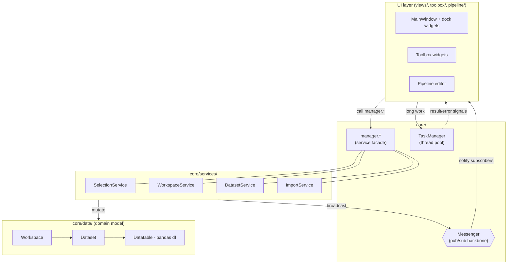

# TSE Analytics — Developer Documentation

This folder is the **developer reference** for TSE Analytics. It explains the architecture,
the patterns that hold the app together, the coding rules and conventions, and a full catalog
of the analysis toolbox. It is aimed at contributors who need to understand the code or extend it.

> For **end-user** documentation (installation, usage walkthroughs, predefined variables) see the
> generated site under `docs/user/`. This `docs/dev/` set is purely for developers and is plain Markdown
> (no build step) — Mermaid diagrams render natively on GitHub.

---

## What is TSE Analytics?

A **PySide6 desktop application** for analyzing experimental data produced by TSE Systems hardware:
**PhenoMaster**, **IntelliCage**, and **IntelliMaze**. It imports raw measurement data into an
in-memory domain model, lets the user define grouping factors and clean the data, and provides a
large toolbox of statistical / visualization widgets plus a node-based visual pipeline editor.

- **Language / runtime:** Python `==3.14.6`
- **Package manager:** [`uv`](https://docs.astral.sh/uv/) (`uv sync`)
- **Task runner:** [`task`](https://taskfile.dev/) (see `Taskfile.yml`)
- **UI:** PySide6 (Qt 6), docking via `pyside6-qtads`, node graph via `NodeGraphQt`
- **Data:** pandas (numpy-nullable dtypes), DuckDB persistence, scientific stack (scipy,
  statsmodels, scikit-learn, pingouin, seaborn, matplotlib, …)
- **Distribution:** Windows installer (PyInstaller + Inno Setup) and Linux Flatpak —
  see [13-packaging-deployment.md](13-packaging-deployment.md)

---

## The 30-second mental model

The application is built on **four core patterns**. Learn these first — everything else is built
on top of them.

1. **Messaging backbone** — a hierarchical pub/sub `Messenger`. UI components and services
   communicate by broadcasting/subscribing to typed messages instead of calling each other
   directly. → [02-messaging.md](02-messaging.md)
2. **Service facade** — `core/manager.py` wires four singleton services and re-exports their
   methods as module-level functions. You always call `manager.*`; you never instantiate services.
   → [03-services-manager.md](03-services-manager.md)
3. **Domain model** — `Workspace → Dataset → Datatable` (a pandas DataFrame wrapper) plus
   `Animal`, `Factor`, `Variable`, `Report`. → [05-data-model.md](05-data-model.md)
4. **Threading** — long-running work runs in a `Worker` (`QRunnable`) submitted to a shared
   `TaskManager` thread pool; results come back via Qt signals. Never block the UI thread.
   → [04-threading-workers.md](04-threading-workers.md)

---

## Documentation map

| # | Document | What's inside |
|---|----------|---------------|
| — | [README.md](README.md) | This index and the big-picture overview |
| 01 | [01-architecture.md](01-architecture.md) | Package layout, bootstrap (`main.py`, `globals.py`), runtime flow |
| 02 | [02-messaging.md](02-messaging.md) | The `Messenger`, `MessengerListener`, and every message type |
| 03 | [03-services-manager.md](03-services-manager.md) | `manager.py` facade + the four services and their APIs |
| 04 | [04-threading-workers.md](04-threading-workers.md) | `Worker`, `WorkerSignals`, `TaskManager` |
| 05 | [05-data-model.md](05-data-model.md) | `Workspace`/`Dataset`/`Datatable`/`Report`, factors, variables, outliers |
| 06 | [06-persistence.md](06-persistence.md) | DuckDB `.duckdb` format, `_meta_*` tables, legacy pickle |
| 07 | [07-layouts-ui.md](07-layouts-ui.md) | `LayoutManager` (docking), `MainWindow`, views, styles & resources |
| 08 | [08-toolbox.md](08-toolbox.md) | `ToolboxWidgetBase`, the plugin registry, **full widget catalog** |
| 09 | [09-pipeline.md](09-pipeline.md) | `PipelineNode`/`PipelinePacket`/graph, node catalog, editor |
| 10 | [10-modules-extensions.md](10-modules-extensions.md) | The three data-source modules + the extensions pattern |
| 11 | [11-conventions.md](11-conventions.md) | Code style, commands, generated files, deps, testing |
| 12 | [12-extending.md](12-extending.md) | Cookbook: add a widget / node / extension / message / task |
| 13 | [13-packaging-deployment.md](13-packaging-deployment.md) | Windows installer (PyInstaller + Inno Setup) & Linux Flatpak build |

---

## Where do I start?

- **New to the codebase?** Read [01-architecture.md](01-architecture.md), then the four pattern
  docs (02–05) in order.
- **Adding an analysis tool?** Jump to [08-toolbox.md](08-toolbox.md) and the
  [extending cookbook](12-extending.md).
- **Working with import / persistence?** See [10-modules-extensions.md](10-modules-extensions.md)
  and [06-persistence.md](06-persistence.md).
- **Just need the rules?** [11-conventions.md](11-conventions.md) distills the project's coding
  standards and commands.
- **Shipping a build?** [13-packaging-deployment.md](13-packaging-deployment.md) covers the
  Windows installer and the Linux Flatpak build.

> The canonical, always-loaded rules live in `.claude/CLAUDE.md`. These `docs/dev/` docs expand on
> them with rationale, diagrams, and reference detail; they do not replace them.
