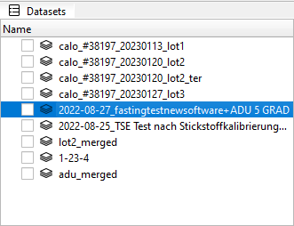
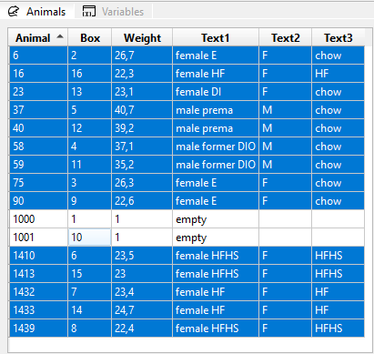
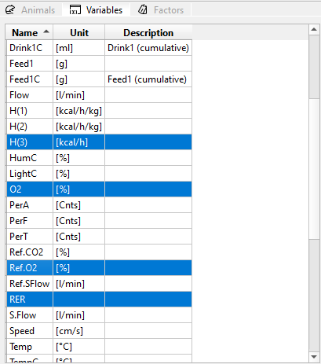
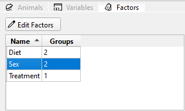

# TSE Analytics

## Overview

TSE Analytics is a data analysis application designed specifically to work with the data output produced by
[TSE PhenoMaster](https://www.tse-systems.com/service/phenotype/) software. It allows a simplified management of
multiple datasets, data sharing and reproducibility of experimental results in a flexible and user-friendly way.

At its core, TSE Analytics provides the following functionality:

- Working with multiple datasets simultaneously with the option to merge individual datasets
and to save the whole workspace for later use.
- Automatic extraction of meaningful metadata from the raw data (i.e. animal information, factors, variables sets)
- Applying different data processing parameters on per-dataset level (e.g. different sampling times, etc.)
- Data filtering on per-animal level, like exclusion of some animals from data processing.
- User-defined flexible time binning with multiple grouping modes: animals, factors or runs.
- Automatic handling of light/dark cycles or manual configuration of time phases
(for instance, "fasting", "pre-feeding", "sleeping", etc.)
- Outliers detection with or without removal of the data entries.
- Export of the pre-processed data for external downstream analysis.

Being modular toolkit by design, TSE Analytics hosts already many data analysis and visualisation capabilities and
can be easily expanded in the future:

- Visualisation of row data on the timeline grouped by animals, factors or time bins.
- Histograms for selected sets of variables together with distribution and normality analysis.
- Calculation of correlations between variables, including linear regression analysis.
- Several forms of ANOVA (N-way, repeated measures, mixed design) and ANCOVA.
- Dimensionality reduction by means of PCA, tSNE or UMAP.

## Main Window

Main window of TSE Analytics is a host of multiple dockable widgets. Users may resize, move and organize the layout
of the main application window up to their liking. Users can hide/show some widgets by using **View** section
in the main menu.

The layout is saved when you quit application.

> Default layout may be restored by clicking **View - Reset Layout** menu item.


## Data structure organization in TSE Analytics

All data in the application are organized in the following manner:

```
├── Workspace
│   ├── Dataset 1
│   │   ├── Metadata 1
│   │   ├── Animals set 1
│   │   ├── Variables set 1
│   │   ├── Factors set 1
│   │   ├── Settings 1
│   ├── Dataset 2
│   │   ├── Metadata 2
│   │   ├── Animals set 2
│   │   ├── Variables set 2
│   │   ├── Factors set 2
│   │   ├── Settings 2
│   ├── Dataset ...
│   │   ├── Metadata ...
│   │   ├── Animals set ...
│   │   ├── Variables set ...
│   │   ├── Factors set ...
│   │   ├── Settings ...
```

Top level data structure is a *Workspace*. It can contain one or many datasets.

Each *dataset* represents a single imported CSV data file from TSE PhenoMaster software. All relevant metadata
extracted during import procedure (e.g. sampling time, animals and variables lists, etc.) Each dataset contains a set of
its own settings. After initial import, dataset is assigned an experiment *Run* number **1** by default.

In order to import dataset, please click **File - Import Dataset** command. As soon as data from CSV file are imported,
you will see a new entry in the *Datasets* widget. By selecting specific entry in this widget, one can switch freely
between different datasets:



> **Note:** Only one dataset can be active at the time in the workspace!

When dataset is selected, all other widgets will be updated accordingly: for example, **Info**, **Animals**,
**Variables** and **Factors** widgets will show information relevant to the active (currently selected) dataset.

Let's have a look at the selection widgets.

### Animals

Here users can select one or many animals from the list of all animals that were registered in the experiment. This
allows to filter (exclude) some of them from further analysis and visualisation.



In order to select all animals at once, please press **CTRL-A** or drag mouse over entries you want to choose.
To select/deselect individual entries, click on the entry holding **CTRL** key.

> **Note**: When there is no selection in the animals list, it is considered as if all animals are selected!

### Variables

This widget is used to choose of one or many variables that you want to display in the **Data** widget table or
include in the downstream analysis in components that support multiple variables selection, like **Matrix** or **PCA**
widgets.



Similarly to **Animals** widget, in order to select all variables at once, please press **CTRL-A** or drag mouse over
entries you want to choose. To select/deselect individual entries, click on the entry holding **CTRL** key.

### Factors


